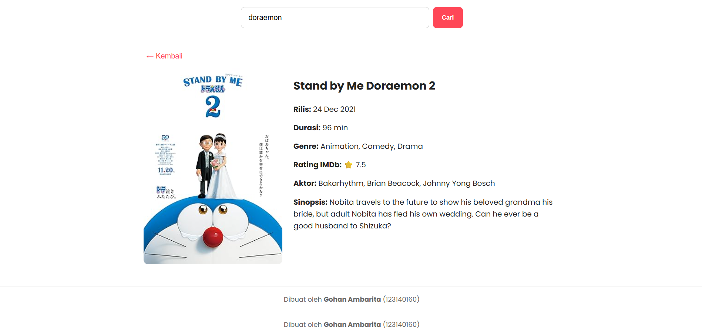

<h1 align="center">🎬 Movie Explorer</h1>
<p align="center">
  <b>UTS Pengembangan Aplikasi Web — 2025</b><br>
  Aplikasi pencarian film interaktif berbasis <b>React + Vite</b> menggunakan <b>OMDb API</b> 🎥
</p>

---

## 👤 Biodata Mahasiswa
| Keterangan | Detail |
|-------------|--------|
| **Nama** | Gohan Ambarita |
| **NIM** | 123140160 |
| **Kelas** | RA |
| **Mata Kuliah** | Pengembangan Aplikasi Web |
| **Dosen Pengampu** | [Masukkan Nama Dosen] |
| **Repository GitHub** | [UTS_Pemweb_123140160_Gohan](https://github.com/14-123140160-GohanTuaJeremiaAmbarita/UTS_Pemweb_123140160_Gohan) |
| **Tahun Akademik** | 2025 |

---

## 🌐 Link Deployment
Aplikasi dapat diakses secara online melalui:
👉 [**Klik di sini untuk membuka Movie Explorer**](https://<masukkan-link-vercel-atau-netlify-di-sini>.vercel.app)

---

## ✨ Deskripsi Singkat
**Movie Explorer** adalah aplikasi web interaktif yang memungkinkan pengguna mencari informasi film dari seluruh dunia secara real-time melalui **OMDb API**.  
Pengguna dapat melihat:
- Judul film  
- Tahun rilis  
- Aktor dan genre  
- Durasi  
- Rating IMDb  
- Sinopsis lengkap  
- Poster film dengan tampilan responsif

Tampilan dibuat dengan tema **putih minimalis elegan** agar nyaman digunakan di berbagai perangkat.

---

## ⚙️ Teknologi yang Digunakan
| Jenis | Teknologi |
|-------|------------|
| **Frontend Framework** | React (Vite) ⚛️ |
| **Styling** | CSS3 (App.css) 🎨 |
| **API Sumber Data** | OMDb API 🍿 |
| **Environment Management** | `.env` (Vite Environment Variables) 🔐 |
| **Build Tools** | Vite ⚡ |
| **Deployment** | Vercel / Netlify 🚀 |

## Cara Instalasi dan Menjalankan Proyek

Jika Anda ingin menjalankan proyek ini di komputer lokal Anda, ikuti langkah-langkah berikut:

1.  **Clone repository ini:**
    ```bash
    git clone [MASUKKAN_URL_GIT_REPOSITORY_ANDA_DI_SINI]
    ```

2.  **Masuk ke direktori proyek:**
    ```bash
    cd [NAMA_FOLDER_PROYEK_ANDA]
    ```

3.  **Install semua dependencies:**
    ```bash
    npm install
    ```

4.  **Jalankan aplikasi di mode development:**
    ```bash
    npm run dev
    ```

5.  Buka `http://localhost:5173` (atau port yang tertera di terminal Anda) di browser.


## Tampilan Aplikasi

Berikut adalah screenshot dari tampilan aplikasi:

**Halaman Beranda**


**Halaman Pencarian**


**Halaman Detail Film**


---


